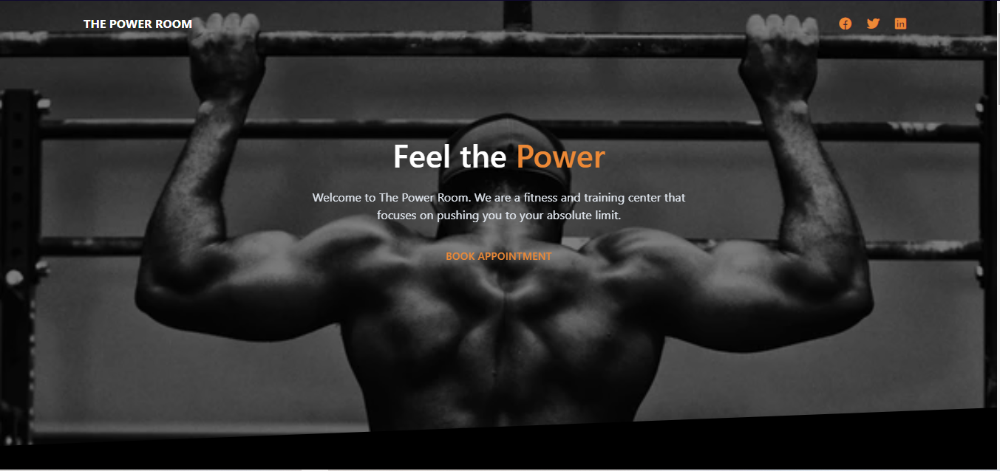
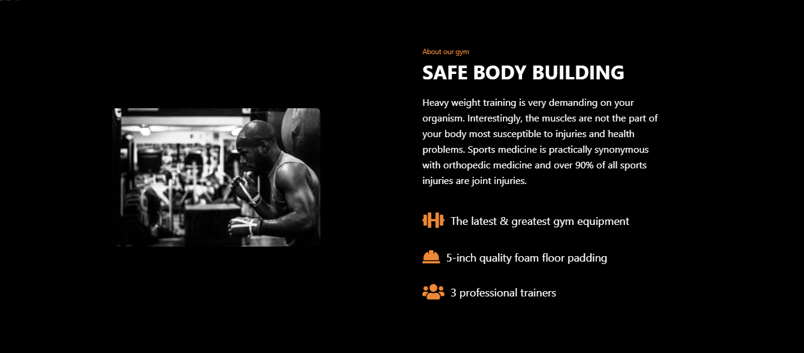
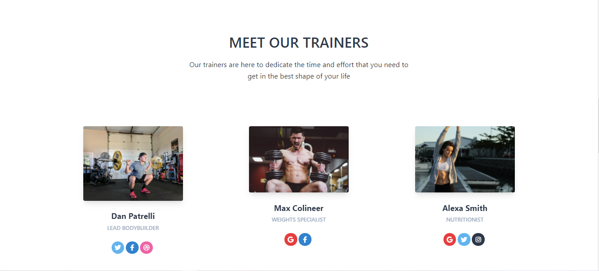
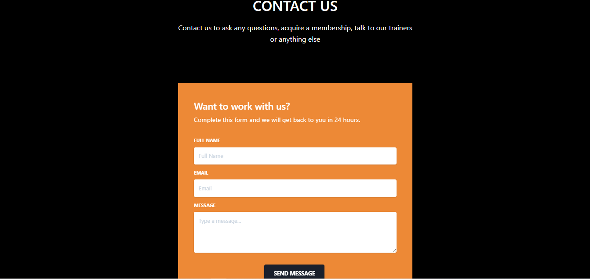
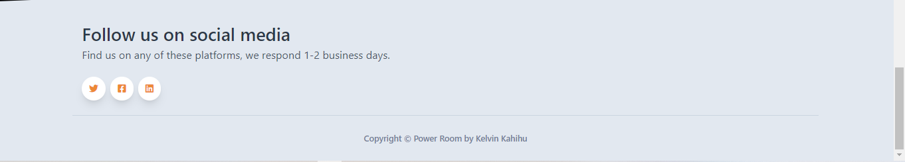

## Looks







## Description
This is a simple gym website created using HTML and Tailwind CSS.

## Demo
[Power Room](https://kelvinkahihu-gym-website.netlify.app/)

## Browser Support

At present, we officially aim to support the last two versions of the following browsers:

| Chrome | Firefox | Edge | Safari | Opera |
|:---:|:---:|:---:|:---:|:---:|
|  |  |  |  |  |

## Reporting Issues

We use GitHub Issues as the official bug tracker for the HTML Landing Page. Here are some advices for our users that want to report an issue:

1. Make sure that you are using the latest version of the HTML Landing Page. Check the CHANGELOG from your dashboard on our <a href="https://www.creative-tim.com/?ref=hlp-tsk-readme" target="_blank">website</a>.
2. Providing us reproducible steps for the issue will shorten the time it takes for it to be fixed.
3. Some issues may be browser specific, so specifying in what browser you encountered the issue might help.

## Versions

<a href="https://github.com/creativetimofficial/tailwind-starter-kit/tree/master/Landing%20Page/angular-landing-page?ref=alp-tsk-readme" target="_blank"></a><a href="https://github.com/creativetimofficial/tailwind-starter-kit/tree/master/Landing%20Page/html-landing-page?ref=alp-tsk-readme" target="_blank"></a><a href="https://github.com/creativetimofficial/tailwind-starter-kit/tree/master/Landing%20Page/react-landing-page?ref=alp-tsk-readme" target="_blank"></a><a href="https://github.com/creativetimofficial/tailwind-starter-kit/tree/master/Landing%20Page/vuejs-landing-page?ref=alp-tsk-readme" target="_blank"></a>


## File Structure
Within the download you'll find the following directories and files:

```
.
|-- assets
|   |-- img
|   |   `-- favicon.ico
|   `-- vendor
|       `-- @fortawesome
|           `-- fontawesome-free
|               |-- LICENSE.txt
|               |-- css
|               |-- js
|               |-- less
|               |-- package.json
|               |-- scss
|               |-- sprites
|               |-- svgs
|               |   |-- brands
|               |   |-- regular
|               |   `-- solid
|               `-- webfonts
`-- index.html
```
